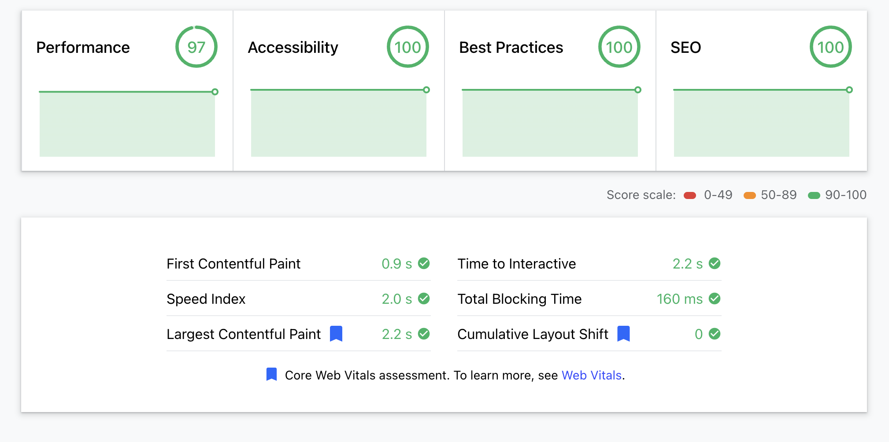

## Introduction

This is a demo Ecommerce site that is using [Next.js](https://nextjs.org) and [Strapi](https://strapi.io).
You can access published site at [https://bejamas-frontend.vercel.app](https://bejamas-frontend.vercel.app) and production CMS at [https://bejamas-apis.onrender.com](https://bejamas-apis.onrender.com)

> This application is not ready for production

## Data Schema and Database

As mentioned in above I'm using Strapi as the Headless CMS and it has multiple content type

- Products
- Banner
- Promo

Here you can find gql schema for the existing components

```graphql
// 1. GQL Queries to get data from Strapi
// 1.1 Banner
const BANNER_QUERY = gql`
  query {
    banners {
      id
      enabled
      text
      buttonLink
      buttonText
    }
  }
`;

// 1.2 featured product
const FEATURED_PRODUCT_QUERY = gql`
  query {
    products(where: { featured: true }) {
      id
      name
      category
      price
      currency
      image {
        src
        alt
      }
      details {
        description
        dimensions {
          width
          height
        }
        size
      }
    }
  }
`;

// 1.3 all products
const ALL_PRODUCTS_QUERY = gql`
  query {
    products {
      id
      name
      category
      price
      currency
      bestseller
      image {
        src
        alt
      }
      details {
        description
        dimensions {
          width
          height
        }
        size
      }
    }
  }
`;

// 1.4 promo data
const PROMO_QUERY = gql`
  query {
    promos {
      enabled
      text
      buttonText
      buttonUrl
    }
  }
`;
```

## APIs

I only developed one API `/api/products` to get list of all products you can try it [here](https://bejamas-frontend.vercel.app/api/products)

## How to load data to Strapi

I developed a Strapi GQL client using Python to load data to Strapi. It's not open sourced yet but you can see below how it works.


## Features

### FeaturedProduct

One of the products has a flag called `featured` that it's a featured artwork. It should be displayed above the product list.

### ProductList

The product list contains 6 artworks. After clicking on "Add to Cart" users can see the product in the cart. Some product in CMS can be flagged as `bestseller` and it will be displayed in the product list.

### AddtoCart

Add Cart Icon shows the numnber of available items in the Cart and when users click on it they see details of the items.
By clicking on "Clear" they can clear the cart.

### Pagination

Products are paginated. On one page we have 6 items. The pagination shows the current page.

### Sorting

Products can be sorted byt price. Hight to Low and Low to High.

### Filtering

Products are filterable. Users can filter products by their category and price range. Category names are loaded dynamically based on existing categories to the list of filters

### Webperformance

Performance of the site is optimized for mobile and desktop.



You can see the report [here](https://lighthouse-dot-webdotdevsite.appspot.com//lh/html?url=https%3A%2F%2Fbejamas-frontend.vercel.app%2F)

### Controloing UI components in Strapi

You can also control some of the UI components in Strapi. For example you can disable the banner and promo. You can change their text, button text and button url.


## How to run it locally

To run this app locally and cpnsume live data from Strapi at [https://bejamas-apis.onrender.com](https://bejamas-apis.onrender.com)

- Create `.env` file at the root of the project and add `STRAPI_GRAPHQL_ENDPOINT = "https://bejamas-apis.onrender.com/graphql"` to it

- In the root of your project run `npm i`
- Run the project by `npm run dev`
